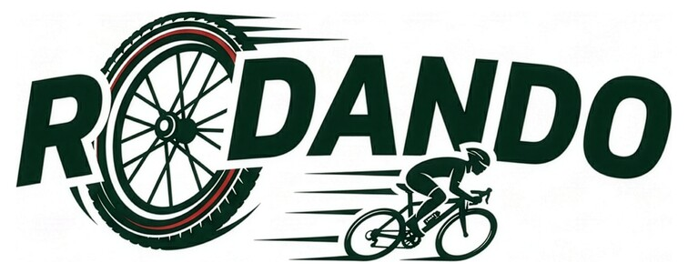
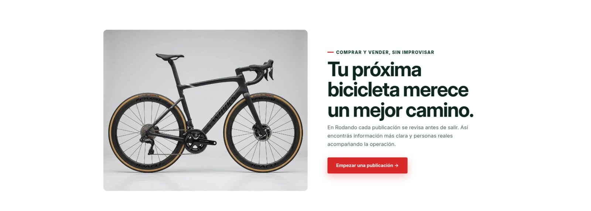

  

<h1 align="center">Rodando Marketplace</h1>

  Marketplace uruguayo especializado en bicicletas usadas. 
  <a href="https://rodando.uy/"><strong>Visitar rodando.uy ↗</strong></a>

## El proyecto

Rodando es un proyecto grupal que busca ofrecer una experiencia digital especializada para comprar y vender bicicletas usadas en Uruguay. El trabajo combina producto, operación, comunicación y tecnología en una plataforma web disponible públicamente.

## Mi aporte

Mi responsabilidad principal dentro del equipo fue el **desarrollo de la plataforma web y del e-commerce**, transformando los requerimientos del proyecto en una experiencia clara, responsive y coherente con la identidad de Rodando.

Trabajé principalmente en:

- Desarrollo y evolución de la interfaz pública.
- Implementación responsive para escritorio y dispositivos móviles.
- Personalización de la experiencia de e-commerce.
- Construcción de la navegación, el catálogo y las páginas de producto.
- Integración de la identidad visual en los distintos recorridos de la plataforma.
- Pruebas, correcciones visuales, publicación y mantenimiento del sitio.
- Coordinación técnica con el equipo para convertir decisiones de producto en funcionalidades web.

## Equipo

Rodando fue desarrollado de manera colaborativa. Las decisiones de producto, identidad y operación reúnen el trabajo de distintas áreas; mi foco principal fue la implementación técnica de la web y del e-commerce.

- [Marcos Devincenzi](https://github.com/marcosdevin04-bit) — desarrollo web y e-commerce.
- [Facundo Díaz](https://github.com/facundevucu) — colaborador del proyecto.
- [Domingo](https://github.com/Domingo1899) — colaborador del proyecto.

## Tecnologías

`WordPress` · `WooCommerce` · `PHP` · `JavaScript` · `HTML` · `CSS` · `Responsive Web Design` · `Git`

## Confidencialidad comercial

Rodando es un proyecto real y en evolución. Por razones comerciales, de seguridad y de privacidad, el repositorio público no incluye el código de producción, la lógica interna del negocio, configuraciones, integraciones privadas, bases de datos ni documentación operativa.

Esta presentación muestra el producto y mi participación profesional sin exponer activos internos del proyecto.

---

Rodando y sus recursos de marca pertenecen al proyecto. Este repositorio no concede derechos de reutilización sobre la marca ni sus materiales.
